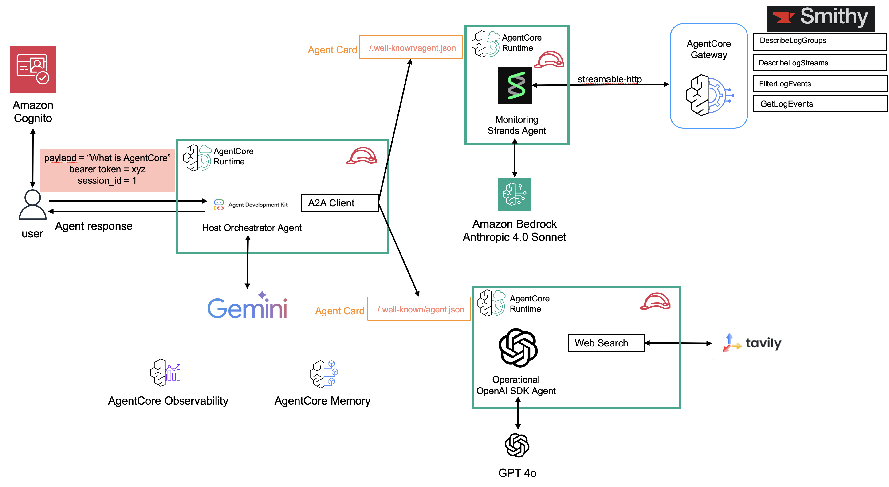

# Agent-to-Agent (A2A) Multi-Agent System on Amazon Bedrock AgentCore for Incident Response Logging

A comprehensive implementation of the [Agent-to-Agent (A2A)](https://a2a-protocol.org/latest/) protocol using specialized agents running on [Amazon Bedrock `AgentCore` runtime](https://docs.aws.amazon.com/bedrock-agentcore/latest/devguide/runtime-a2a.html), demonstrating intelligent coordination for AWS infrastructure monitoring and operations management. This repository walks you through setting up three core agents to answer questions about incidents and metrics in your AWS accounts and search for best remediation strategies. A monitoring agent (built using the [`Strands` Agents SDK](https://strandsagents.com/latest/)) is responsible for handling all questions related to metrics and logs within AWS and cross AWS accounts. A remediation agent (built using [`OpenAI`'s Agents SDK](https://openai.github.io/openai-agents-python/)) is responsible to doing efficient web searches for best remediation strategies and optimization techniques that the user can ask for. Both agents run on separate runtimes as `A2A` servers and utilize all `AgentCore` primitives - memory for context management, observability for deep level analysis about both agents, gateway for access to tools (`Cloudwatch`, `JIRA` and `TAVILY` APIs) and `AgentCore` identity for enabling inbound and outbound access into the agent and then into the resources that the agent can access using OAuth 2.0 and APIs. These two agents are then managed by a host [`Google ADK` agent](https://google.github.io/adk-docs/) that acts as a client and delegates tasks to each of these agents using A2A on Runtime. The Google ADK host agent runs on a separate `AgentCore` runtime of its own.

## Demo


## Architecture Overview



## What is A2A?

<details>
  <summary>Agent-to-Agent (A2A)</summary>
   **Agent-to-Agent (A2A)** is an open standard protocol that enables seamless communication and collaboration between AI agents across different platforms and implementations. The A2A protocol defines:

   - **Agent Discovery**: Standardized agent cards that describe capabilities, skills, and communication endpoints
   - **Communication Format**: JSON-RPC 2.0-based message format for reliable agent-to-agent communication
   - **Authentication**: OAuth 2.0-based security model for secure inter-agent communication
   - **Interoperability**: Platform-agnostic design allowing agents from different frameworks to collaborate

   Learn more about the A2A protocol: [A2A Specification](https://a2a.foundation/)

   ## A2A Support on Amazon Bedrock AgentCore

   Amazon Bedrock AgentCore provides native support for the A2A protocol, enabling you to:

   - **Deploy A2A-compliant agents** as runtime services with automatic endpoint management
   - **Secure authentication** via AWS Cognito OAuth 2.0 integration
   - **Agent discovery** through standardized agent card endpoints
   - **Scalable deployment** leveraging AWS infrastructure for production workloads
   - **Built-in observability** with CloudWatch integration and OpenTelemetry support

   AgentCore simplifies A2A agent deployment by handling infrastructure, authentication, scaling, and monitoring automatically.
</details>

## Prerequisites

1. **AWS Account**: You need an active AWS account with appropriate permissions
   - [Create AWS Account](https://aws.amazon.com/account/)
   - [AWS Console Access](https://aws.amazon.com/console/)

2. **AWS CLI**: Install and configure AWS CLI with your credentials
   - [Install AWS CLI](https://docs.aws.amazon.com/cli/latest/userguide/getting-started-install.html)
   - [Configure AWS CLI](https://docs.aws.amazon.com/cli/latest/userguide/cli-configure-quickstart.html)
   - **Important**: Set your region to `us-west-2`

   ```bash
   aws configure set region us-west-2
   ```

3. **Python 3.8+**: Required to run the deployment scripts

4. **uv**: Install uv package manager using [guide](https://docs.astral.sh/uv/getting-started/installation/)

5. **API Keys**: You'll need the following API keys (the deployment script will prompt for these):
   - **OpenAI API Key**: Get from [OpenAI Platform](https://platform.openai.com/api-keys)
   - **Tavily API Key**: Get from [Tavily](https://tavily.com/)
   - **Google API Key**: Get from [Google AI Studio](https://aistudio.google.com/app/apikey)

6. **Supported Regions**: This solution is currently tested and supported in the following AWS regions:

   | Region Code   | Region Name          | Status      |
   |---------------|----------------------|-------------|
   | `us-west-2`   | US West (Oregon)     | ✅ Supported |

   > **Note**: To deploy in other regions, you'll need to update the DynamoDB prefix list mappings in `cloudformation/vpc-stack.yaml`. See the [VPC Stack documentation](cloudformation/vpc-stack.yaml) for details.

## Quick Start Deployment

The easiest way to deploy this solution is using our automated deployment script:

```bash
# Clone the repository
git clone https://github.com/awslabs/amazon-bedrock-agentcore-samples.git
cd 02-use-cases/A2A-multi-agent-incident-response

# Run the interactive deployment script
uv run deploy.py
```

The deployment script will:

1. ✅ Verify AWS CLI is installed and configured
2. ✅ Check AWS credentials are valid
3. ✅ Confirm region is set to `us-west-2`
4. ✅ Interactively collect all required parameters
5. ✅ Generate unique S3 bucket names
6. ✅ Save configuration to `.a2a.config`
7. ✅ Automatically deploy all stacks in the correct order
8. ✅ Wait for each stack to complete before proceeding

**Total deployment time**: Approximately 10-15 minutes

## React Frontend

Run the frontend using following commands.

```bash
cd frontend
npm install

chmod +x ./setup-env.sh
./setup-env.sh

npm run dev
```

## Google ADK Web App

[Agent Development Kit Web](https://github.com/google/adk-web) is the built-in developer UI that integrated with Google Agent Development Kit for easier agent development and debug.


1. Follow setup [instructions](https://github.com/google/adk-web?tab=readme-ov-file#-prerequisite).
2. From the root of this [project](./) run `adk web`.

## A2A Protocol Inspector

The [A2A Inspector](https://github.com/a2aproject/a2a-inspector) is a web-based tool designed to help developers inspect, debug, and validate servers that implement the A2A (Agent2Agent) protocol. It provides a user-friendly interface to interact with an A2A agent, view communication, and ensure specification compliance.


1. Follow Setup and Running the Application [instructions](https://github.com/a2aproject/a2a-inspector?tab=readme-ov-file#setup-and-running-the-application).
2. Get URL and bearer token from:

   ```bash

   uv run monitoring_strands_agent/scripts/get_m2m_token.py   
   # OR
   uv run web_search_openai_agents/scripts/get_m2m_token.py   
   ```

3. Paste the URL & bearer token (`Bearer <Add Here>`) on A2A Inspector and add two headers `Authorization` and `X-Amzn-Bedrock-AgentCore-Runtime-Session-Id`. The value of `X-Amzn-Bedrock-AgentCore-Runtime-Session-Id` should be atleast 32 characters (`550e8400-e29b-41d4-a716-446655440000
`).

## Test Scripts

Test individual agents using the interactive script:

```bash
# Test monitoring agent
uv run test/connect_agent.py --agent monitor

# Test web search agent
uv run test/connect_agent.py --agent websearch

# Test host agent
uv run test/connect_agent.py --agent host
```

## Cleanup

### Automated Cleanup (Recommended)

The easiest way to clean up all resources is using our automated cleanup script:

```bash
# Run the cleanup script
uv run cleanup.py
```

The cleanup script will:

1. 🔍 Load your deployment configuration from `.a2a.config`
2. 📋 Show all resources that will be deleted
3. 🔒 Require double confirmation (including typing 'DELETE')
4. 🗑️ Delete all resources in the correct reverse order:
   - Host Agent Stack
   - Web Search Agent Stack
   - Monitoring Agent Stack
   - Cognito Stack
   - S3 Bucket and contents
5. ⏱️ Wait for each deletion to complete before proceeding

**Total cleanup time**: Approximately 10-15 minutes

> [!WARNING]
> This will permanently delete all deployed resources. This action cannot be undone!

### Troubleshooting Cleanup

If cleanup fails or you encounter errors:

1. **Check stack status** in the AWS CloudFormation console
2. **Manual resource deletion**: Some resources may need to be deleted manually if they have dependencies
3. **S3 bucket not empty**: Ensure the bucket is completely empty before deletion
4. **Review CloudWatch Logs**: Check for any errors in stack deletion events
